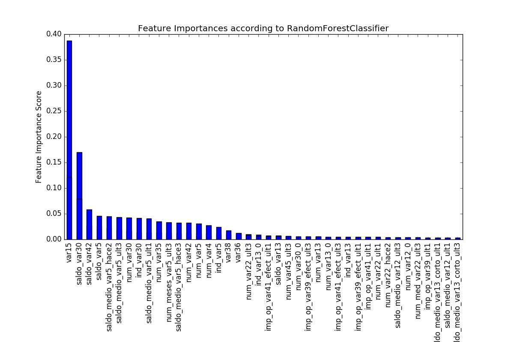
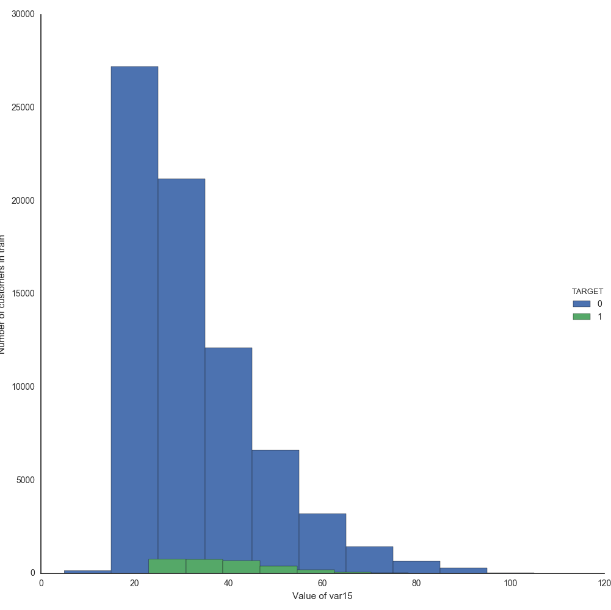

# Santander Customer Satisfaction

## Problem Description

We are trying to solve the following challenge

https://www.kaggle.com/c/santander-customer-satisfaction

The unique thing about this challenge is that we'll work with hundreds of **anonymized** features. We want to predict if a customer is satisfied or dissatisfied with their banking experience.

## Challenge

Since the features are **anonymized**, we dont have a clue what they mean. Here is the top row from the training data

    ID,var3,var15,imp_ent_var16_ult1,...,TARGET
    1, 2,   23,   0,...,                 0

So, just by looking at the column names, we cannot make an educated guess on which featires are important. So we have to dive into statistics and plot each feature to look deep into how it affects the `TARGET`

## Setup

1. Anaconda is ideal but not required. We will be working with `Python 3.5.2`
2. Please use `requirements.txt` for installing required packages

## Approach

1. `sklearn` classifiers have a `feature_importances_` attribute which can give us a list of features that are important in terms of predicting `TARGET`.The importance of a feature is computed as the (normalized) total reduction of the criterion brought by that feature. It is also known as the Gini importance.Gini Importance or Mean Decrease in Impurity (MDI) calculates each feature importance as the *sum over the number of splits (across all tress) that include the feature, proportionally to the number of samples it splits.*
2. We can get a list of features as described in `1` above and then plot these features using `matplotlib`. This would allow us to look deeper into the feature to see if it actually makes sense.
3. Once we are satisfied with the features, we can build our classifiers.

## Tools

1. `pandas` for reading in the data and cleanup. `numpy` for manipulations and conversions.
2. Combinations of `RandomForestClassifier`,`AdaBoostClassifier`,`GradientBoostingClassifier`,`ExtraTreesClassifier`,`LogisticRegression` and `XGBClassifier` for modeling and predictions.

## Steps

### 1. Preprocessing

Preprocessing and data cleanup is performed by `preproc.ReadIn`. Basically, we just remove the constant (standard deviation = 0)
and duplicated columns. A closer look reveals that the features seem to be divided into the following categories

1. `var`: This prefix seems to indicate a variable
2. `num_var` or `num_op` or `num_`: This prefix seems to indicate the count/quantity of a variable
3. `saldo`,`imp` and `delta`: It is difficult to gauge what these prefixes represent but seems like they refer to some mathematical function(s)

### 2. Important features

`resources/plots/models` has plots for the top 40 features for each of `ExtraTreesClassifier`, `RandomForestClassifier`, `GradientBoostingClassifier` and `AdaBoostClassifier`

For instance *RandomForestClassifier.png* is 

these features are also stored in `resources/feats` as json

### 3. Generating and analyzing plots

Looking at the features created in step 2, we can generate plots for these and try to make some sense of the features. `hub.Explore.py` generates plots for all of the features. The plots can be found in `resources/plots`. There are three kinds of plots

1. `resources/plots/vars`: Here we generate two plots for each variable that is named such as `var15`. We generate a bar plot with two sets of bars. Green bars represent that the value of `TARGET` is 1 and Blue bars represent that the value of `TARGET` is 0

For each of these variables, we also generate a kernel density plot, which just gives us another way to visualize

2. `resources/plots/num_vars`: Here we generate the bar and density plots for the variables named such as `num_var4`.

and the kernel density

3. `resources/plots/logs`: The other variables are hard to visualize using bar and kernel density plots as all of the values are between 0 and 1 in most cases. So, here we generate the log of the value and then plot it against the `TARGET`. Here we will see one plot for `TARGET`=0 and the other for `TARGET`=1

#### Rationale
The plots allow us to see what the desired values for a variable should be. This can be ascertained by looking at either the peaks in the bar or kernel density plots, or looking at the clusters of lines in the log plots. The key idea is to look at the plots and decide if there is a clear distinction between the values for `TARGET 0`  and `TARGET 1` for a particular variable. If so, then in an incoming test data row, we can clearly make a distinction. For instance, look at the feature `saldo_var13_corto`. The corresponding plot is 
  
For `TARGET 0`, we can clearly see a dense concentration between 11.5 and 13. In contrast, there is just a single line at 11.5 for `TARGET 1`. Now, lets say a new test data point comes in with a value `saldo_var13_corto=12.5`. In this case, it would be pretty safe to predict that `TARGET=0`. In fact, for most values, except 11.5, the training data shows that the value of `TARGET` would be 0. Thus, examining the plots with this rationale will help us in narrowing down the features that can direct our predictions in a concrete manner. On the other hand, consider the feature `num_meses_var13_corto_ult3` and its kernel density plot

As we can see, the major peaks for `TARGET 0` and `TARGET 1` overlap so there is no clear indication where a new test data point with value such as `num_meses_var13_corto_ult3=0` would lie. This particular plot also highlights another interesting point. The major peaks indicate that most of the values for this variable are `0.0`. There are some minor peaks at `1.0`,`2.0` and `3.0` but their size relative to the size of the peak at 0.0 indicate that the number of data points outside of `0.0` are negligible. I have chosen to ignore such variables in favor of others where there is not much disparity between peak sizes as this indicates a more even distribution of values among the data points.
### 4. Predicting using Ensemble
`hub.Ensemble.py` creates an ensemble of `RandomForestClassifier`,`AdaBoostClassifier`,`GradientBoostingClassifier` and `XGBClassifier`. The features selected for training are a combination of features generated in step 2. Some other features have also been added by examining the plots, as explained in the **Rationale** above. These features are stored at `constants.feat_list.py`